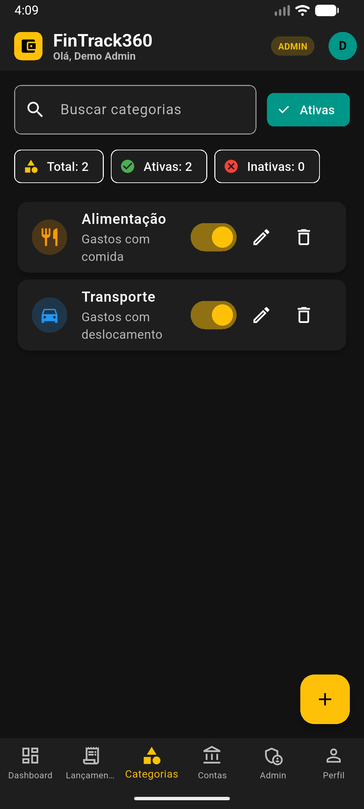
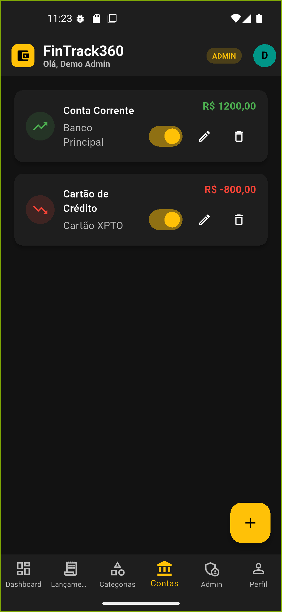
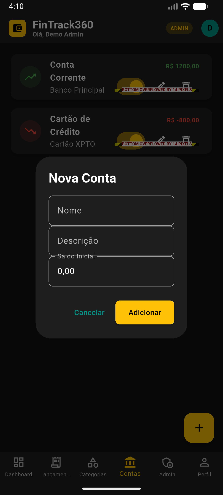

# FinTrack360 — Flutter/Dart demo (GitHub Pages)


[](https://github.com/reinaldobarreto/fintrack360/releases/latest/download/fintrack360-app-debug.apk)

[](https://flutter.dev/)
[](https://dart.dev/)

[](https://pub.dev/packages/shared_preferences)
[](https://github.com/features/actions)
[](https://pages.github.com/)

[](https://github.com/reinaldobarreto/fintrack360/actions/workflows/deploy.yml)

Aplicativo Flutter para controle financeiro pessoal/familiar. Foco em mobile-first e teste rápido via web.

<p>
  
  
  
  
</p>

## Overview
- Stack principal: **Flutter/Dart** (mobile-first + build web para demo)
- Deploy: **GitHub Pages** automatizado via **GitHub Actions**
- Autenticação e dados: **Local** (SharedPreferences no Android/iOS; localStorage no Web)
- Screenshots e assets padronizados em `assets/images/` (tela_*)

## Demo
- `https://reinaldobarreto.github.io/fintrack360/` (será publicado automaticamente após o primeiro push para `main`).

### Tecnologias e Ferramentas
[](https://skillicons.dev)

### Galeria rápida
Visual do app em uma grade compacta para leitura rápida:
<p align="center">
  
  
  
</p>
<p align="center">
  
  
  
</p>

## Como clonar e importar (VS Code e Android Studio)

### Requisitos
- Flutter `stable` (3.x) e Dart SDK (incluso no Flutter)
- Git instalado
- VS Code com extensões: `Flutter` e `Dart`
- Android Studio com Android SDK e AVD (emulador) configurados
- Navegador Chrome (para executar em Web)
- Verifique o ambiente: `flutter doctor` e resolva eventuais pendências

### Clonar o projeto
```bash
git clone https://github.com/reinaldobarreto/fintrack360.git
cd fintrack360
flutter pub get
```

### Importar e rodar no VS Code
- Abra o projeto: `code .`
- Habilite Web (uma vez): `flutter config --enable-web`
- Selecione o dispositivo: `Ctrl+Shift+P` → `Flutter: Select Device` → `Chrome` (ou emulador Android)
- Rode o app: `F5` ou `flutter run -d chrome`

### Importar e rodar no Android Studio
- Abra: `File → Open...` e selecione a pasta `fintrack360`
- Instale plugins `Flutter` e `Dart` se solicitado
- Aceite licenças do Android: `flutter doctor --android-licenses`
- Crie/abra um emulador: `AVD Manager` → crie um dispositivo (por exemplo, Pixel 5 API 34)
- Baixe dependências: `flutter pub get`
- Rode: selecione o emulador no topo e clique em `Run`

### Execução rápida por linha de comando
- Web (Chrome): `flutter run -d chrome`
- Android (emulador ou dispositivo físico): `flutter run`

### Autenticação e armazenamento
- Sem login de demonstração: acesso somente com cadastro e login.
- Persistência por plataforma:
  - Android/iOS: `SharedPreferences` (armazenamento local do dispositivo).
  - Web: `localStorage` (via `shared_preferences` para web).
- Usuário administrador pode apenas listar usuários; não há opção de deletar.

### Problemas comuns
- Se o Gradle/SDK falhar, rode: `flutter clean && flutter pub get`
- Se não encontrar Android SDK, abra o Android Studio para instalar o SDK/Platform Tools e execute `flutter doctor` novamente

### Extras visuais
- Emojis e badges ajudam na leitura: ✅📱💻
- Use imagens da pasta `assets/images/` para destacar telas específicas.

## Imagens do Funcionamento
Para explicar visualmente o funcionamento no GitHub, inclua capturas de tela na pasta `assets/images/` usando nomes padronizados:


### O que cada imagem mostra
- Login Mobile: campos de e‑mail/senha e ação de entrar (sem pular login).
- Dashboard Mobile: KPIs, gráficos e saldo por período (receitas − despesas).
- Lançamentos Mobile: lista com filtros/ordenação, tipos (RECEITA/DESPESA) e categorias.

### Como adicionar rapidamente
1. Faça as capturas no dispositivo/emulador (PNG/JPG).
2. Rode o script para copiar/renomear automaticamente:
   ```bash
   pwsh -File ./fintrack360/scripts/rename_screenshots.ps1
   ```
3. Confirme os arquivos gerados em `assets/images/` e faça commit/push.

### Dica: imagens lado a lado
Você pode usar HTML no README para controlar largura/posição:
<p align="center">
  
  
  
  
</p>

Observação: as imagens no README aparecem diretamente no GitHub (independente do GitHub Pages). GitHub Pages afeta apenas a demo publicada em `gh-pages`.

### Outras telas (já no projeto)
Para já mostrar o que existe hoje no repositório, você pode referenciar estas capturas:


## Publicação (GitHub Pages)
- Já existe um workflow em `.github/workflows/deploy.yml` que compila e publica automaticamente na branch `gh-pages`.
- O `base-href` é dinâmico e usa o nome do repositório.
- Passos:
  1. Crie o repositório no GitHub.
  2. Faça push para `main`.
  3. Verifique em “Settings → Pages” se a publicação está ativa na `gh-pages`.

## Desenvolvimento
- O app funciona sem backend remoto. Todo estado e dados são locais ao dispositivo/navegador.

## Autor
- Reinaldo Barreto — Flutter/Dart
## 📝 Observações
- Não há login de demonstração. Para acessar, crie sua conta na tela de cadastro.

## 🚀 Publicar no GitHub Pages (gh-pages)
1) Habilite Web no Flutter (uma vez):
   - `flutter config --enable-web`
2) Construa a versão Web com modo demo local ativado:
   - `flutter build web --release --dart-define=USE_LOCAL_DEMO_AUTH=true`
3) Ajuste o `base href` para seu repositório (GitHub Pages):
   - Edite `web/index.html` e defina `<base href="/<nome-do-repo>/">`.
   - Exemplo: se publicar em `seuusuario.github.io/fintrack360`, use `<base href="/fintrack360/">`.
4) Publique o conteúdo de `build/web` na branch `gh-pages`:
   - Crie a branch `gh-pages` e copie os arquivos de `build/web` para a raiz.
   - Faça push da branch e, nas configurações do GitHub, ative Pages apontando para `gh-pages`/`root`.
5) Alternativa (automática): use o workflow em `.github/workflows/deploy-gh-pages.yml` com ação manual (`workflow_dispatch`).
## 🔗 Demo Web (GitHub Pages)
- Acesse: https://reinaldobarreto.github.io/fintrack360/
- Cadastre-se e faça login para acessar o app. Os dados ficam no `localStorage`.

<p>
  <a href="https://reinaldobarreto.github.io/fintrack360/" target="_blank">
    
  </a>
  <a href="https://github.com/reinaldobarreto/fintrack360" target="_blank">
    
  </a>
</p>

## 📌 Sobre o Projeto
- App Flutter focado em Mobile (Android/iOS) com suporte a Web.
- Para testes públicos (GitHub Pages), o login demo é local e não cria contas reais.
- Login padrão disponível: `admin@fintrack.com` / `admin1234`.

### Tecnologias (projeto — Flutter/Dart)
<p>
  
  
  
  
  
</p>

### Ambiente e IDEs (Flutter/Dart)
<p>
  
  
</p>

### Plataformas Mobile
<p>
  
  
</p>

## 🧪 Como o recrutador pode avaliar
- Abra a Demo Web no link acima.
- Cadastre-se e faça login; navegue pelos lançamentos, contas e gráficos.
- O estado é local ao navegador e não há deleção de usuários.

## 📱 Build Mobile
- Android APK: `flutter build apk --release`
- Android AppBundle (Play Store): `flutter build appbundle --release`
- iOS (requer macOS e Xcode): `flutter build ios --release` e Archive pelo Xcode.
